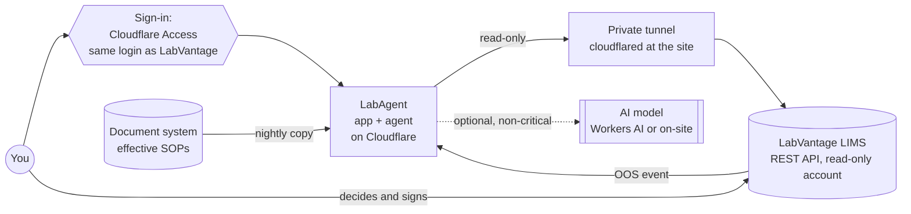

# LabAgent Implementation Guide

**For:** someone who knows the QC laboratory well (samples, methods, instruments, SOPs, OOS) but has
never worked with a LIMS.
**Goal:** take LabAgent from the demo you can open today to a validated assistant beside a
LabVantage LIMS, one safe step at a time.
**Status of LabAgent:** demonstration with synthetic data; not released for GMP use (see the
[validation report](validation/validation-report.md)). This guide is how you get it there.

Live demo: <https://labagent.mkatballe.workers.dev> · Code: <https://github.com/Katballe/labagent>

---

## Part A — Understand

### 1. What a LIMS is, in lab terms

A LIMS (Laboratory Information Management System) is the lab's system of record. It replaces the
paper sample log, the worksheets, the result spreadsheets, the instrument logbooks and the training
matrix with one database where every entry is attributable, time-stamped and audit-trailed. If you have
worked in a paper-based or hybrid lab, you already know every process a LIMS runs; it just holds them
in one place and enforces the rules.

| What you do today | What the LIMS does | LabVantage word |
|---|---|---|
| Write the sample into the receipt log, stick on a label | **Sample login**: creates a sample record with a unique ID and prints the barcode | Sample (an SDC — see below) |
| Pick the tests from the spec sheet | **Test assignment** from the product's specification and test plan | Test / specification / work item |
| Fill in a worksheet, calculate in a template | **Data entry** into a LIMS worksheet; calculations are part of the configured method | Worksheet, data set, data item |
| Compare the result with the spec by eye | **Specification check**: pass / fail / out of specification, automatically | Spec evaluation; OOS flag |
| Second person checks and signs | **Review and approval** with an electronic signature (who, when, meaning) | Review / approval workflow |
| Instrument logbook, calibration sticker | **Instrument record** with calibration due date; the LIMS can block an out-of-calibration instrument | Instrument, calibration/maintenance schedule |
| Training matrix on the wall | **Certification** per analyst and method; the LIMS can block an unqualified analyst | Training / certification |
| Correct a mistake with a single line, initials and date | **Audit trail**: old value, new value, who, when, why — automatically and permanently | Audit trail |
| Batch record, CoA | **Reports and certificates** generated from approved results | Reports / CoA |

**LabVantage vocabulary you'll hear.**
- **SDC** — a configurable "data collection": the type of record (Sample, Instrument, User…). An individual
  record is often called an **SDI**.
- **Policies** — configuration objects that switch features on or off. Two matter here: the
  **SecurityPolicy** (who and what may connect, including REST services) and the **RESTPolicy**
  (which records the REST web services expose, and which fields).
- **REST API** — the documented way for another system to read (and, if allowed, write) LIMS data. Your
  LabVantage instance lists what is enabled at `https://<your-labvantage>/rest/api`.
- **ConnectionId / token** — how an external system proves who it is. Only two requests work without
  one (`GET /rest` and `POST /rest/connections`); LabVantage also offers token authentication for
  external applications.

**Environments.** A validated LIMS runs as several copies: DEV (configuration work), TEST, VAL
(validation) and PROD (real GMP work). You never try things in PROD. Everything in this guide happens in
TEST/VAL first.

**Validation in lab terms.** A computerised system is qualified the way you qualify an HPLC:

| HPLC | Computerised system |
|---|---|
| User requirements (what the lab needs) | URS |
| IQ — installed correctly | IQ — deployed version, configuration and connections are the intended ones |
| OQ — each function works to spec | OQ — each function behaves as specified, including error handling |
| PQ — performs with real samples | PQ / acceptance — performs on realistic, independent test cases |
| Requalification after repair | Change control — assess, re-test, document |
| Logbook | Audit trail |

For AI there is one more rule, from the draft **EU GMP Annex 22**: test data must be independent — the
questions used to accept the system must never have been used to build or tune it. Think of it as a
blind sample in a proficiency test.

### 2. What LabAgent adds — and what it never does

LabAgent sits beside the LIMS and helps people use it. It has three helpers:

| Helper | What you ask | What you get |
|---|---|---|
| **SOP assistant** | "What's the acceptance criterion for dissolution in MV-0412?" | The exact passage from the effective SOP, with its section — or "undecided" if the SOPs don't answer it. With AI enabled, a short answer in plain words **next to** that passage. |
| **Data look-up** | "Which instruments are overdue for calibration?" | A read-only query over LIMS data and its result. Validated query templates first; an AI-drafted query only if no template fits, and then labelled UNVALIDATED. |
| **OOS Phase 1 triage** | An OOS result appears | The evidence gathered in a fixed sequence (sample, instrument calibration at run time, analyst certification, related OOS, precedents) and a proposed classification by the SOP decision tree. A qualified person reviews and signs. |

**The rules it follows** (from the draft Annex 22):
- **Decisions are never made by AI.** Refusals, validated queries, the OOS findings and the
  classification are fixed rules that were tested. Generative AI is not allowed in critical GMP
  applications, and the OOS record is critical.
- **AI only assists, visibly.** Any AI-written text is labelled, shown with its source, checked by code
  (it must cite what it was given), and reviewed by you. You can mark every answer ✓ or ✗; that is
  logged.
- **It never writes to the LIMS.** It reads. You make changes in LabVantage, with LabVantage's own
  e-signature, as you do today.
- **Everything is recorded.** Every question, answer, query, approval and review goes into a
  tamper-evident audit trail.

### 3. How the pieces fit



- **LabAgent** runs on Cloudflare: the web app and an *agent* per user session that does the work and
  keeps the audit trail.
- **The tunnel** is a small program on a server inside your network that lets LabAgent reach LabVantage
  without opening the firewall.
- **Sign-in** uses Cloudflare Access with the same company login as LabVantage, so every audit entry
  has a verified name.
- **The AI model** is optional. If data may not leave your site, run a model on site, or run without one;
  the decisions don't depend on it.

---

## Part B — Prepare

### 4. The team

| Role | Who, typically | Does | Time |
|---|---|---|---|
| Process owner | QC lab manager | Owns the intended use; approves go-live | Sign-offs |
| Process SME | Experienced analyst or QC specialist (possibly you) | Intended use, acceptance criteria, writes and labels the held-out test questions, reviews results | 5–10 days spread over the project |
| LIMS administrator | LabVantage system administrator / key user | Service account, REST policies, test instance, OOS event | 3–5 days |
| IT / network | Infrastructure team | Tunnel server, firewall rules, identity provider app | 2–3 days |
| Cloud administrator | Whoever owns the Cloudflare account | Deploys LabAgent, Access, secrets | 1–2 days |
| Developer | Internal or contractor | Connects LabAgent to LabVantage and the document system | 4–8 weeks |
| QA / CSV | Computerised-system validation specialist | Reviews and approves validation documents and deviations | Throughout |
| Users | Analysts and reviewers | Training; use; record ✓/✗ verdicts | 1–2 h training |

The person who writes the held-out test questions (SME) must not be the developer (Annex 22 §6.5).

### 5. Decisions to take before you start

| Decision | Options | Recommendation |
|---|---|---|
| May lab data be processed outside the site? | (a) Workers AI on Cloudflare; (b) an AI model on a server at the site (Ollama); (c) no AI model | Start with (c) for the data look-up and OOS helpers, which don't need a model; decide (a) or (b) for SOP wording with IT security and QA |
| Which helper first? | Data look-up · SOP assistant · OOS triage | Data look-up first: read-only, easy to test, immediately useful |
| How to read LabVantage | (A) LabVantage REST API directly; (B) a small read-only service at the site over reporting views | (A) if the REST resources hold what you need; (B) when you need history ("calibration status on the run date") that REST doesn't expose |
| Where do investigations live? | LabVantage · a separate QMS | Wherever they live today; LabAgent never changes that |
| LabVantage CORTEX | Already licensed? Covers the same use? | Ask your LabVantage contact first; use the Annex 22 questions in the [LabVantage analysis](labvantage-integration.md) to compare |

### 6. Accounts and access checklist

- [ ] Cloudflare account owned by the company (not a personal one), with Workers Paid recommended
- [ ] GitHub organisation or account for the code, with branch protection on `main`
- [ ] A LabVantage **TEST** instance you are allowed to connect to
- [ ] A named service account in LabVantage, **read-only**
- [ ] A server (small VM) inside the network for the tunnel
- [ ] The company identity provider (Entra ID, Okta…) able to add Cloudflare Access as an application
- [ ] Read access to the document management system's effective SOPs (API or export)
- [ ] QA agreement on the validation approach (the documents in `docs/validation/` are your templates)

---

## Part C — Build

Each phase ends with a **checkpoint**: something signed or verified before you move on.

### Phase 0 — Plan and govern (1–2 weeks)

1. Copy the documents in `docs/validation/` and adapt them to your lab: start with
   [intended-use.md](validation/intended-use.md) (what each helper is for, who is responsible for what)
   and the [risk assessment](validation/risk-assessment.md).
2. Take the decisions in §5 with the process owner, IT security and QA.
3. Do the supplier assessments: Cloudflare (hosting, security certifications, data processing terms)
   and, if used, the AI model provider.
4. Classify the data LabAgent will see (sample IDs, results, analyst names) and record where it may be
   processed.

> **Checkpoint 0** — intended use, risk assessment and data decision approved by the process owner and QA.

### Phase 1 — Your own LabAgent on Cloudflare (1–2 days)

This gives you a working copy under your company's control, still with the synthetic demo data.

1. **Install the tools** on your PC: [Node.js](https://nodejs.org) 22 LTS and Git.
2. **Get the code:**
   ```bash
   git clone https://github.com/Katballe/labagent.git
   cd labagent
   npm ci
   ```
3. **Try it locally.** `npm run dev` opens the app in instant mode at http://localhost:5173.
   `npm run agent:local` runs the app *with* the agent at http://localhost:8788 (no AI model locally).
4. **Log in to Cloudflare** (opens a browser): `npx wrangler login`
5. **Deploy:** `npm run deploy`. It runs all 148 automated checks first and stops if any fails; then it
   prints the address, e.g. `https://labagent.<your-subdomain>.workers.dev`.
6. **Check the installation:** open `https://labagent.<your-subdomain>.workers.dev/api/health`. You
   should see `"llm": true`, the pinned model, a `config` fingerprint and `"worker": {"tag": …}`.
7. **Automatic deploys (recommended):** create a Cloudflare API token with the "Edit Cloudflare
   Workers" template (add Workers AI permission if the deploy asks for it) and store it as the GitHub
   secret `CLOUDFLARE_API_TOKEN`. From then on every change merged to `main` is checked and deployed by
   GitHub Actions, tagged with its commit.
8. **Turn on sign-in (Cloudflare Access):**
   1. Cloudflare dashboard → **Zero Trust** → **Access** → **Applications** → **Add an application** →
      **Self-hosted**.
   2. Application domain: your LabAgent address. Identity provider: your company login.
   3. Policy: allow the group of lab users (e.g. "QC-Analysts", "QC-Reviewers").
   4. From the application's overview copy the **Application Audience (AUD) tag**; your team domain is
      `<team>.cloudflareaccess.com`.
   5. In `wrangler.jsonc` set `ACCESS_TEAM_DOMAIN` and `ACCESS_AUD`, commit, deploy.
   6. Open `/api/health` again: `"identity": "cloudflare-access"`. Audit entries now carry verified
      e-mail addresses instead of "(unverified)".
9. **If AI may not be used yet:** set `"LLM_ENABLED": "false"` in `wrangler.jsonc` and deploy. Every helper
   then works deterministically.

> **Checkpoint 1** — health check shows your commit, the expected fingerprint and `cloudflare-access`;
> record it as the first IQ entry.

### Phase 2 — Read-only connection to LabVantage (2–4 weeks)

**2.1 Ask the LabVantage administrator for:**
- a **TEST** instance connection address;
- a **service account** (e.g. `svc_labagent`) with a role that can only *view* the records below;
- REST services enabled in the **SecurityPolicy** for that account, and a **RESTPolicy** that enables
  **GET only** on: samples, test results with specification status, instruments with calibration
  history, and analyst certifications (names depend on your configuration — the administrator knows
  them);
- the authentication method allowed for external applications (token, or ConnectionId via
  `POST /rest/connections`);
- the list of enabled resources at `https://<your-labvantage>/rest/api`.

**2.2 Build the private route (tunnel).** On the site server, with IT:
```bash
cloudflared tunnel login
cloudflared tunnel create labvantage-readonly
cloudflared tunnel route dns labvantage-readonly lv-api.<your-domain>
```
Configure the tunnel (`config.yml`) to forward `lv-api.<your-domain>` to the LabVantage TEST address,
run it as a service, and protect `lv-api.<your-domain>` with its own Access application that only
accepts a **service token**. LabAgent will send that token; nothing else can use the route.

**2.3 Store the credentials as secrets** (never in the code):
```bash
npx wrangler secret put LV_BASE_URL             # https://lv-api.<your-domain>
npx wrangler secret put LV_ACCESS_CLIENT_ID     # Access service token
npx wrangler secret put LV_ACCESS_CLIENT_SECRET
npx wrangler secret put LV_TOKEN                # or LV_USER / LV_PASSWORD for /rest/connections
```

**2.4 Connect the code.** The pipeline asks its data source for results through one function,
`exec()`. Today that is the synthetic SQLite database (`worker/db.js`). The developer replaces it with a
LabVantage source. Two ways:

- **(A) REST directly.** Each validated template becomes a named read over the REST API. Starting point
  (a template — the paths must come from your `/rest/api` page):
  ```js
  // worker/sources/labvantage.js — TEMPLATE, adapt to your instance
  export function labVantageSource(env) {
    const headers = {
      "CF-Access-Client-Id": env.LV_ACCESS_CLIENT_ID,
      "CF-Access-Client-Secret": env.LV_ACCESS_CLIENT_SECRET,
      accept: "application/json",
      // plus the authentication your SecurityPolicy allows (token or ConnectionId)
    };
    async function get(path, params = {}) {
      const res = await fetch(`${env.LV_BASE_URL}${path}?${new URLSearchParams(params)}`, { headers });
      if (!res.ok) throw new Error(`LabVantage ${res.status} on ${path}`);
      return res.json();
    }
    return {
      // One function per validated template. GET only — there is deliberately no other verb here.
      async oosResults({ batch, sinceDays }) { /* get("<results resource>", {...}) → rows */ },
      async instrumentsDue({ days }) { /* get("<instrument resource>", {...}) */ },
      async certifications({ method }) { /* get("<certification resource>", {...}) */ },
    };
  }
  ```
- **(B) A small read-only service at the site.** A tiny service next to the database runs the
  validated SQL templates against read-only reporting views and returns JSON through the tunnel.
  Choose this when you need history (calibration status on the run date, certification on the run
  date) that the REST resources don't expose.

**2.5 Test it (OQ).** For every template, pick records in the TEST instance whose answer you know and
write them down as expected results before running. Then prove it cannot write, at every layer:
the service account can't edit in the LabVantage UI; a PUT/POST through the tunnel is refused by the
RESTPolicy; and LabAgent's own guard declines "delete…" requests.

> **Checkpoint 2** — every template returns the expected records from TEST; all write attempts fail;
> results recorded.

### Phase 3 — Your SOPs (1–3 weeks)

1. **Export the effective SOP sections** from the document system: one chunk per section, with
   document ID, version, section number and title, status (EFFECTIVE, or SUPERSEDED if you want
   conflicts detected), and the text.
2. **Load them** into the corpus (today `src/data/knowledge.js` and `src/data/dataset.js`; for a real lab,
   a nightly job that copies effective versions and rebuilds the index). The configuration fingerprint
   changes whenever the corpus changes — that is intended: it shows the SOPs moved on.
3. **Run the automated checks** (`npm run evals`). The "records & corpus integrity" checks confirm every
   listed document is searchable and every cited ID exists.
4. **Tune only on the development questions** (`src/evals/cases.js`): add typical questions from your
   lab, adjust synonyms (e.g. your lab's abbreviations) until they pass. **Do not look at the held-out
   questions** (Phase 5) while tuning.

> **Checkpoint 3** — corpus loaded from effective versions only; development checks pass.

### Phase 4 — OOS triage wired to LabVantage (3–6 weeks)

1. **Trigger.** Ask the LabVantage administrator how an OOS result can notify an external system (an
   event or workflow step calling a web address, directly or through your integration middleware). It
   calls LabAgent with the sample and result IDs.
2. **Evidence.** Each of the 8 steps reads its evidence through the data source — at **run time**, not
   today: the result and its specification version, the instrument's calibration status on the run
   date, the analyst's certification on the run date, related OOS results (same instrument, batch or
   method in the last 90 days), and precedent investigations.
3. **Findings.** Each step's finding is a fixed sentence template filled with the facts read — never AI
   text. The classification follows your SOP's decision tree.
4. **Decision.** The reviewer opens the draft, checks every step, and approves or rejects in LabAgent;
   then files the investigation in LabVantage or the QMS with that system's own e-signature, as today.
5. **Test** with historical OOS cases whose outcome you know (including ones that turned out *not* to be
   lab errors).

> **Checkpoint 4** — historical cases reproduce the documented facts and classification; the reviewer
> can trace every finding to its LabVantage record.

### Phase 5 — Validate (2–4 weeks)

1. **Finish the documents** you adapted in Phase 0: URS, functional spec, risk assessment, test plan,
   traceability matrix. QA reviews.
2. **Write the held-out questions (the SME, not the developer).** In a spreadsheet, without looking at
   the development questions or the code:
   - at least **75 questions the SOPs answer**, spread over your document types, phrased the way
     colleagues really ask — note for each the document and section that answers it;
   - at least **75 questions they don't answer**: off-topic, unknown IDs, data held elsewhere
     (stability, approvals), and *near misses* (detail close to an SOP topic but not in it);
   - **data questions** whose correct records you look up yourself in LabVantage;
   - **OOS evidence questions** for a few historical cases.
   Have a second SME check every expected answer. Keep the file where the developer can't open it.
3. **Freeze it.** The questions go into `src/evals/heldout-HT-002.js` (same structure as
   `src/evals/heldout.js`, with `ID = "HT-002"`) and are frozen with
   `npm run validate -- --set HT-002 --freeze`: the file's fingerprint is stored and every later run is
   logged in `validation/test-data-access.log`.
4. **Run the acceptance test** once, on the release version:
   `npm run validate -- --set HT-002 --purpose "acceptance"`.
   It prints the confusion matrix, sensitivity, specificity, citation accuracy and each acceptance
   criterion, and stores the run under `validation/runs/`.
5. **If a criterion fails**, record a deviation, investigate, and change the system under change
   control. The held-out set is then *used up*: the next acceptance run needs new questions. (The
   script enforces this.)
6. **IQ on production**, then write the validation report and collect the signatures.

> **Checkpoint 5** — validation report approved; release decision by the process owner and QA.

### Phase 6 — Go live and operate

1. **Train the users** (1–2 hours): what LabAgent decides and what it doesn't; the controlled SOP
   governs; how to read the source passage and record ✓/✗; UNVALIDATED queries must be checked in
   LabVantage; what approving an OOS draft means.
2. **Write the user SOP** for LabAgent (who may use it, for what, their responsibilities).
3. **Weekly check (system owner, 15 minutes):** open the **Compliance** tab —
   - self-check passed every day and the model's output was identical in the probe;
   - override rate (✗ answers) below 5 %;
   - "undecided" and "withheld" rates steady;
   - new words people ask about that the SOPs don't contain → a gap in the SOPs, or use outside the
     intended purpose.
4. **Every change** (SOP update, synonym, template, model, LabVantage upgrade) goes through change
   control: impact, automated checks, and — for anything that changes how questions are answered — a
   new held-out test ([operations](operations/model-lifecycle.md)).
5. **Periodic review** every 6 months, and when the final Annex 22 is published.

---

## Part D — Reference

### Daily use (for analysts)

| You want to… | Do this | Remember |
|---|---|---|
| Check what an SOP says | Ask in **Assistant** | Read the passage on the right. It governs, not the wording. Record ✓ or ✗. |
| Look something up in LIMS data | Ask in **Data query** | "VALIDATED TEMPLATE" results are tested; "UNVALIDATED · AI-WRITTEN" results must be checked in LabVantage. |
| Start a Phase 1 investigation | **OOS triage** → review every step | Approving means you reviewed every step and its evidence. File the record in LabVantage/QMS as usual. |
| See what happened | **Audit trail** → Verify chain | Anyone can verify the chain; nobody can edit it. |

### Troubleshooting

| Symptom | Likely cause | Fix |
|---|---|---|
| Top bar says "instant (no model)" on your company address | The agent isn't reachable | Check `/api/health`; check the latest deploy in GitHub Actions |
| Deploy stops at "Check the Cloudflare token is set" | GitHub secret missing | Add `CLOUDFLARE_API_TOKEN` (Phase 1, step 7) |
| Deploy refused on the AI binding | Token lacks Workers AI permission | Add Workers AI to the token |
| "Too many requests" | Rate limit (30 per minute per user) | Wait a minute; raise the limit in `wrangler.jsonc` if genuine |
| Answers say "Today's AI budget is used up" | Daily AI cap reached | Deterministic answers continue; raise `LLM_DAILY_CAP` if needed |
| Audit entries show "(unverified)" | Access not configured | Phase 1, step 8 |
| LabVantage returns 401/403 | Token/ConnectionId expired, or resource not enabled | Renew credentials; ask the administrator to check the RESTPolicy |
| No answer for a normal question ("undecided") | A word the SOPs don't use | Add a synonym in the development set process (Phase 3.4) — never tune on held-out questions |

### Glossary

| Term | Meaning |
|---|---|
| ALCOA+ | Data must be Attributable, Legible, Contemporaneous, Original, Accurate — plus Complete, Consistent, Enduring, Available |
| Annex 11 / Annex 22 | EU GMP annexes for computerised systems and (draft) artificial intelligence |
| Audit trail | Automatic, permanent record of who did what, when, and why |
| Change control | Assess → approve → test → document before changing a validated system |
| Configuration fingerprint | A checksum over everything that determines LabAgent's answers; changes when anything changes |
| CSV / CSA | Computerised system validation / assurance |
| Deterministic | Same input, same output, every time |
| E-signature | Electronic signature with name, time and meaning (e.g. "approved") |
| GAMP 5 | Industry guide for validating computerised systems |
| Held-out test set | Questions kept away from development and used once to accept the system |
| Human in the loop (HITL) | A qualified person is responsible for any AI output before it is used |
| IQ / OQ / PQ | Installation, operational, performance qualification |
| LIMS | Laboratory Information Management System |
| OOS | Out of specification |
| RESTPolicy / SecurityPolicy | LabVantage settings for what external systems may read and how they log in |
| SDC / SDI | LabVantage record type / individual record |
| Service account | A non-personal account used by a system, with the minimum rights needed |
| Tunnel | A private, outbound-only connection from your network to Cloudflare |
| UNDECIDED | LabAgent's answer when the SOPs don't contain the answer |

### Go-live checklist

- [ ] Intended use, URS, risk assessment, test plan approved
- [ ] Access on; `/api/health` shows `cloudflare-access`, the release commit and the validated fingerprint
- [ ] Service account read-only; RESTPolicy GET-only; write attempts fail at every layer
- [ ] SOP corpus from effective versions; development checks pass
- [ ] Held-out acceptance test passed on an SME-written, second-SME-verified set
- [ ] Deviations closed or accepted by QA; validation report signed
- [ ] Users trained; user SOP effective
- [ ] Weekly monitoring owner named; periodic review scheduled
- [ ] Audit trail export and archive in place

### Where things are

| Path | What |
|---|---|
| `src/ai/pipeline.js` | The logic all three helpers share (and the rules above) |
| `worker/` | The agent on Cloudflare |
| `src/data/` | Demo corpus, OOS case and database — replaced by your SOPs and LabVantage |
| `src/evals/cases.js` | Development questions (tune here) |
| `src/evals/heldout.js`, `validation/` | Held-out questions, their lock, access log and run records |
| `docs/validation/` | Validation document templates, filled in for the demo |
| `docs/labvantage-integration.md` | The LabVantage analysis behind this guide |
