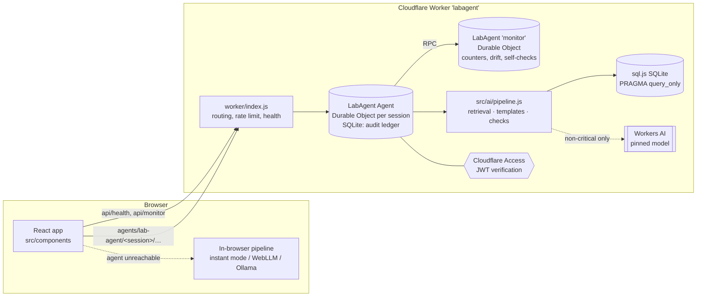

# Functional and Design Specification — LabAgent Cloudflare agent

| | |
|---|---|
| Document | FS-001, version 1.0 |
| Implements | [URS-001](urs.md) |
| Code | `worker/` (agent), `src/ai/pipeline.js` (shared pipeline), `src/compliance/config.js` (pinned configuration) |
| Status | **Draft — approval pending** |

## 1. Architecture

- **One code path.** The browser and the agent call the same pipeline (`src/ai/pipeline.js`) with an
  injected model (`llm`) or none. Guard rails are in the pipeline, not in the model.
- **One agent instance per browser session** (`s-` + 24 hex characters, generated in the browser),
  holding that session's audit ledger. In production the instance would be keyed by the Access
  identity or by site.
- **One `monitor` instance** that is not reachable over HTTP; session instances call it by RPC.

## 2. Components

| ID | Component | Behaviour | Implements |
|---|---|---|---|
| FS-01 | Retriever (`src/ai/rag.js`) | TF-IDF over chunks (text + document title + section + tags); light stemmer; phrase and synonym maps. Returns top 4 chunks, a coverage-based confidence (0–1), a superseded/effective conflict flag and the question words absent from the corpus. | URS-001, -003, -005 |
| FS-02 | Refusal gate (`pipeline.answerQuestion`) | UNDECIDED if any question word ≥ 3 letters is absent from the corpus vocabulary (after synonyms), or if confidence < threshold. Records `decision`, `reason`, `confidence`, `threshold`, `retrieved`. | URS-002, -003 |
| FS-03 | Extractive answer (`src/ai/extract.js`) | Without a model: quotes the best passage verbatim (and a second only if it covers ≥ 20 % more of the question); never a superseded passage when an effective one exists; each quote cites document + section; returns `matched` words per cited passage. | URS-001, -004, -005 |
| FS-04 | Generative answer | With a model: system prompt `T1_SYSTEM`, sources numbered; temperature 0, seed 20260927, max 500 tokens. `INSUFFICIENT_EVIDENCE` → UNDECIDED. `checkDocCitations`: ≥ 1 cited document, all among those given, else withheld (`reason: citation-check`). Cites = only the passages the model cited. | URS-007, -008 |
| FS-05 | Query templates (`src/ai/nl2sql.js`) | Deterministic mapping of the question to parameterised SELECTs (calibration due/overdue/history/status, qualifications, counts, OOS, results by batch/sample/instrument/method/analyst/window, listings). Change requests are recognised first (`writeIntent`) and declined. | URS-011, -012 |
| FS-06 | AI-drafted query | Only when no template matches and a model is present: `T2_SYSTEM`, temperature 0; result `source: "model"`, `validated: false`, note says UNVALIDATED — informational only. | URS-012 |
| FS-07 | Read-only guard (`src/ai/sqlcore.js`) | Lexes out strings and comments; exactly one statement; must start with SELECT/WITH; rejects write/DDL/PRAGMA/ATTACH/transaction keywords; the agent also rejects RECURSIVE. | URS-010, -013 |
| FS-08 | Read-only database (`worker/db.js`) | sql.js (browser build, WASM passed in) seeded from `src/data/seed.js`, then `PRAGMA query_only = ON`; rows capped at 500. | URS-010, -013 |
| FS-09 | OOS workflow (`src/data/dataset.js`, `pipeline.stepFinding`) | 8 fixed steps with fixed `finding` text and evidence; `stepFinding` returns the fixed text and never calls a model. Triage questions: extractive over the evidence, or model with `checkRecordIds`. | URS-006, -014 |
| FS-10 | Audit ledger (`worker/agent.js`, `src/lib/audit.js`) | Table `ledger(seq INTEGER PRIMARY KEY, entry TEXT)`. `append()` is serialised; each entry = `{seq, id, ts, actor, kind, action, model, prompt, content, contentHash, prevHash, hash}`, `hash` = SHA-256 over the canonical field list; `content` = JSON with question, outcome, confidence, retrieved/cited passages, model settings, `config` fingerprint, Worker version id/tag, `actorVerified`. No update or delete statement exists in the code. | URS-015, -016, -017 |
| FS-11 | Identity (`worker/access.js`) | Verifies `Cf-Access-Jwt-Assertion` (RS256, team certs cached 1 h, audience, issuer, expiry). Without `ACCESS_TEAM_DOMAIN`/`ACCESS_AUD`, or on failure: `<name> (unverified)`. The unsigned `Cf-Access-Authenticated-User-Email` header is never trusted. | URS-018 |
| FS-12 | Model adapter & fallback (`worker/llm.js`, `LabAgent.withModel`) | `env.AI.run(CLOUD_MODEL.id, {messages, temperature, seed, max_tokens})`. Each call first takes one unit of the daily budget from the monitor; on budget exhaustion or model error the same request is answered deterministically with a note. | URS-019, -021 |
| FS-13 | Monitor (`LabAgent` instance `monitor`) | Counters per UTC day (`t1:answered`, `t1:undecided`, `t1:reason:*`, `t2:*`, `t3:*`, `review:confirmed/incorrect`, `llm-calls`), out-of-corpus terms per day, self-check history. Cron `15 3 * * *` → `selfCheck()`: runs the development suite in the agent (incl. engine read-only and model-path checks) and a determinism probe (same question twice through the model; identical output and citation check). Manual trigger at most hourly. | URS-022 |
| FS-14 | Configuration fingerprint (`src/compliance/config.js`) | SHA-256 over app version, prompt version and texts, generation settings, cloud model id, threshold, corpus, OOS steps and draft, database schema/rows/date. Identical in browser, agent and build. Build commit injected at build time (`__BUILD_COMMIT__`); Worker version id/tag from `CF_VERSION_METADATA`. | URS-019, -020 |
| FS-15 | Rate limiting (`worker/index.js`) | Workers rate-limit binding, 30 POST requests / 60 s per client IP; daily model cap `LLM_DAILY_CAP` (default 1500 calls). | URS-023 |
| FS-16 | Deterministic fallback in the browser | On load the app calls `api/health`; if the agent is not there (Pages mirror, offline) it runs the pipeline in the browser without a model (instant mode). | URS-024 |
| FS-17 | Test tooling | `scripts/run-evals.mjs` (development suite, prebuild gate); `scripts/validate.mjs` (held-out set: hash lock, access log, consumed-set guard, metrics, AC evaluation, run records). | URS-025, -026 |

## 3. Interfaces (HTTP)

All responses are JSON with `cache-control: no-store`. POST bodies are JSON; text fields are
truncated (questions 500, SQL 4000, event content 4000 characters).

| Method & path | Body | Returns | Audit entry |
|---|---|---|---|
| `GET /api/health` | — | `{service, app, prompt, llm, model, modelLabel, config, worker:{id,tag,timestamp}, identity}` | — |
| `GET /api/monitor` | — | counters (14 days), drift terms (7 days), last 10 self-checks, pinned model and settings | — |
| `POST /api/selfcheck` | — | self-check result (or "skipped" if run within the hour) | — |
| `POST /agents/lab-agent/<session>/ask` | `{question, threshold?, reviewer?}` | T1 result + `auditId`, `engine`, `note` | T1 |
| `POST …/query` | `{question, reviewer?}` | T2 result (`source`, `validated`, `sql`, `cols`, `rows`, `note`) + `auditId` | T2 |
| `POST …/sql` | `{sql, reviewer?}` | raw read-only query result + `auditId` | T2 |
| `POST …/triage` | `{question, reviewer?}` | T3 explanation + `auditId` | T3 |
| `POST …/event` | `{kind ∈ T3, REVIEW, SYS, EVAL; action; content}` | `{auditId}` | as given |
| `POST …/review` | `{ref: AUD-nnnnn, verdict: confirmed \| incorrect, note?}` | `{auditId}` | REVIEW |
| `GET …/audit` | — | `{entries, verification, ledger}` | — |

Any other path under `/agents/` or `/api/` → 404. Paths outside `/api/*` and `/agents/*` are served
from the built app.

## 4. Configuration (under change control)

| Item | Value | Where |
|---|---|---|
| Worker name | `labagent` | `wrangler.jsonc` |
| Model | `@cf/meta/llama-3.3-70b-instruct-fp8-fast` | `src/compliance/config.js` |
| Generation | temperature 0, seed 20260927, max tokens T1 500 / T2 300 / T3 350 | `src/compliance/config.js` |
| Prompt version | v2.0.0 | `src/ai/prompts.js` |
| Refusal threshold | 0.60 default | `src/compliance/config.js` |
| Daily model cap | 1500 calls | `wrangler.jsonc` → `LLM_DAILY_CAP` |
| Model switch | `LLM_ENABLED` (`"false"` disables the model) | `wrangler.jsonc` |
| Identity | `ACCESS_TEAM_DOMAIN`, `ACCESS_AUD` (empty = unverified) | `wrangler.jsonc` |
| Rate limit | 30 requests / 60 s per IP | `wrangler.jsonc` |
| Durable Object | class `LabAgent`, SQLite storage, migration `v1` | `wrangler.jsonc` |
| Compatibility | date 2026-09-01, `nodejs_compat` | `wrangler.jsonc` |

## 5. Security

- No credentials in the repository; the deploy token lives only as the `CLOUDFLARE_API_TOKEN`
  GitHub secret.
- The monitor instance rejects all HTTP; it is reachable only by RPC from session instances.
- Session names are validated (`s-[0-9a-f]{24}`); a session's ledger is only reachable by its name.
  In this demo the name is the only secret. **Production must put the Worker behind Cloudflare
  Access** and key instances by verified identity.
- Model output never executes: SQL passes the guard and the read-only engine; text is rendered as
  text.

## 6. Error handling

| Situation | Behaviour |
|---|---|
| Model error / budget exhausted | Deterministic answer, `note` explains |
| SQL error | `ok: false`, error in `note`, nothing written |
| Guard rejection | `rejected: true`, reason in `note`, nothing executed |
| Monitor unreachable | Answer still returned; counters skipped (monitoring never blocks answering) |
| Agent unreachable from the browser | App stays in instant mode; engine dialog explains |
| Rate limit | HTTP 429 with a retry message |

## 7. Platform notes

- Workers AI calls are metered; the free allocation is limited. The daily cap bounds cost.
- The daily self-check runs the full development suite (≈ 150 cases) inside the Durable Object. On the
  Workers Free plan's CPU limits this may be cut short; Workers Paid is recommended (open item in the
  validation report).
- Deploying the `ai` binding may need the API token to include Workers AI permission in addition to
  the "Edit Cloudflare Workers" template.
